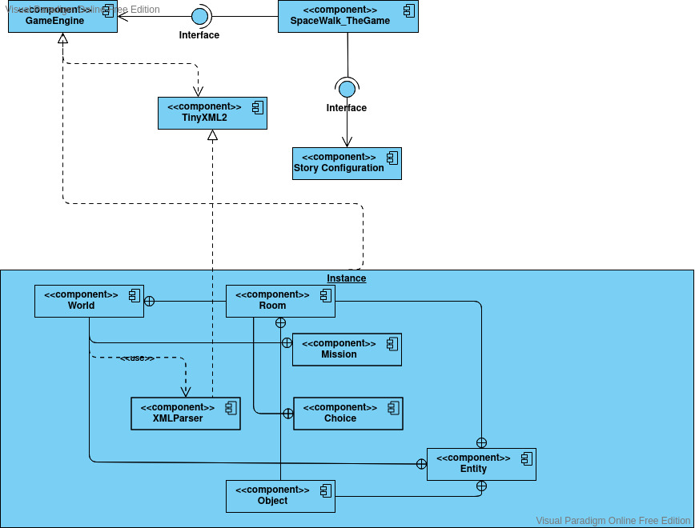
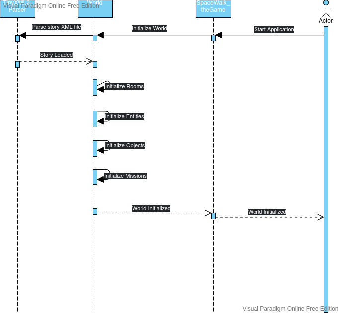

# SpaceWalk_TheGame

A Roleplay Space adventure game. You can move room to room, collect items and open new paths to explore the game world. Meet and interact with NPCs.

## Business Requirements

1. Command line user interface
2. Load story from file
3. User choices change storyline
4. User can interact with **NPC**s
5. User can interact with items
6. (8bit Graphics)

## Technical Requirements

1. Create class hierarchy / architecture.
2. Define Use Cases.
3. Define Activities with diagrams.

## Architecture

### Component Architecure

### World Initialization Sequence

## References

[TinyXML2](https://github.com/leethomason/tinyxml2)