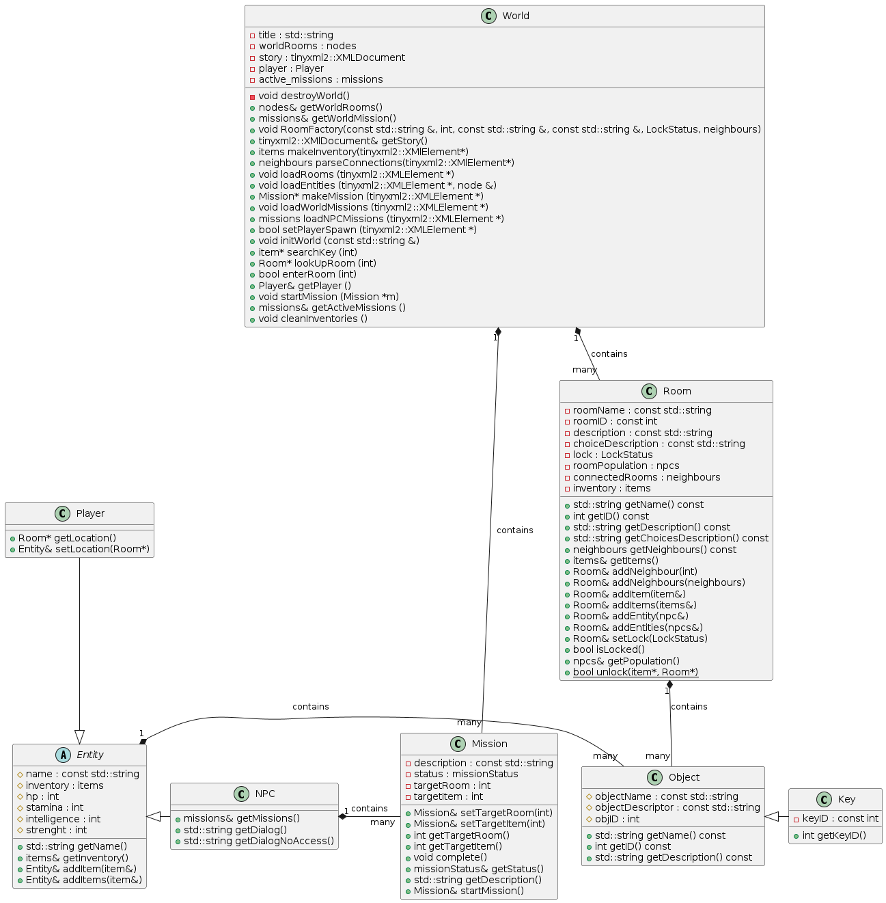
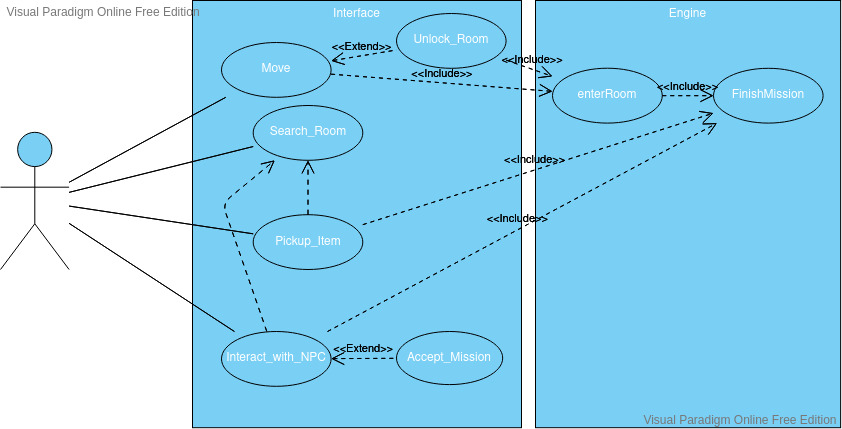
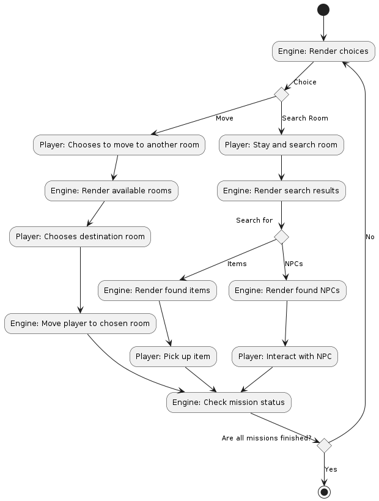

# SpaceWalk_TheGame

A Roleplay Space adventure game. You can move room to room, collect items and open new paths to explore the game world. Meet and interact with NPCs.

## Business Requirements

1. Command line user interface
2. Load story from file
3. User choices change storyline
4. User can interact with **NPC**s
5. User can interact with items
6. (8bit Graphics)

## Technical Requirements

1. Create class hierarchy / architecture.
2. Define Use Cases.
3. Define Activities with diagrams.

## Architecture

### Class Architecture



### Component Architecure


### World Initialization Sequence


### Functional Use Case diagram



### Game Loop Activity Diagram



## References

[TinyXML2](https://github.com/leethomason/tinyxml2)

## Build with cmake

CMake legenerálja a makefile-t a CMakeLists.txt alapján, majd a `make` parancs segítségével lehet lefordítani a programot.

### Spacewalk

```
mkdir build && cd build
cmake ../
```

### Test Room

```
mkdir build && cd build
cmake ../ -DTEST_ROOM=ON
```

### Test World 

```
mkdir build && cd build
cmake ../ -DTEST_WORLD=ON
```
### Test Object 

```
mkdir build && cd build
cmake ../ -DTEST_OBJECT=ON
```

### Test session manager 

```
mkdir build && cd build
cmake ../ -DTEST_SESSION=ON
```

### Test Interface 

```
mkdir build && cd build
cmake ../ -DTEST_INTERFACE=ON
```

### Test Unit 

```
mkdir build && cd build
cmake ../ -DTEST_UNIT=ON
```